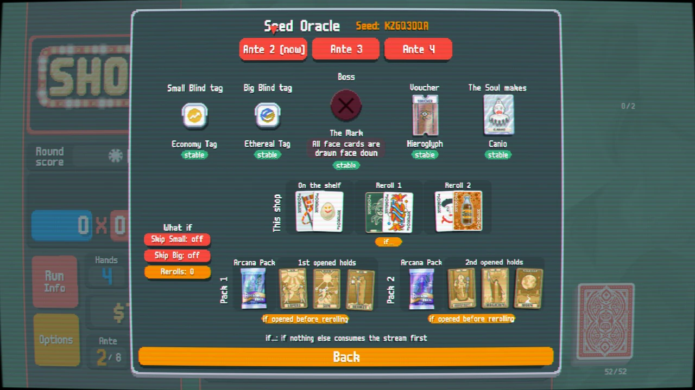
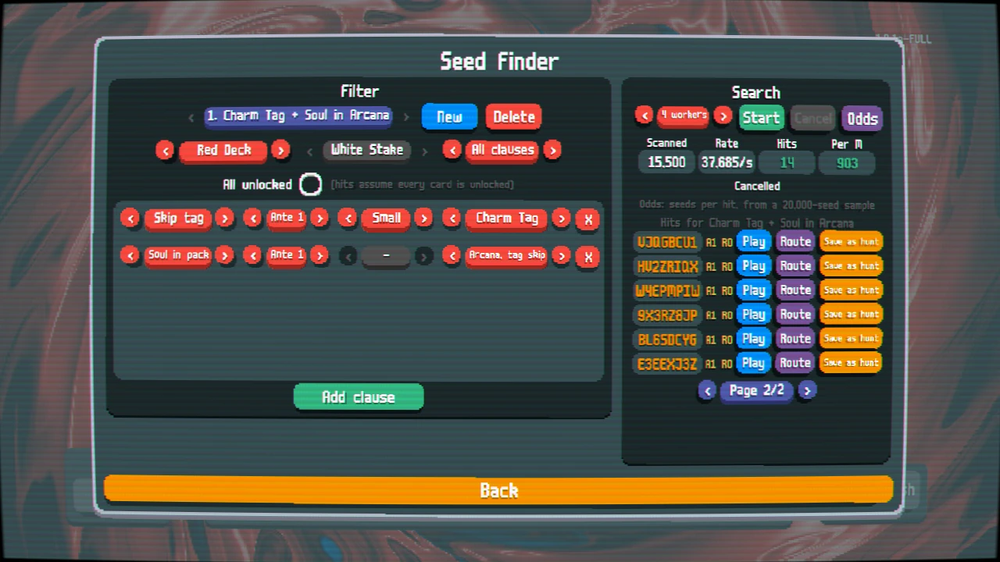
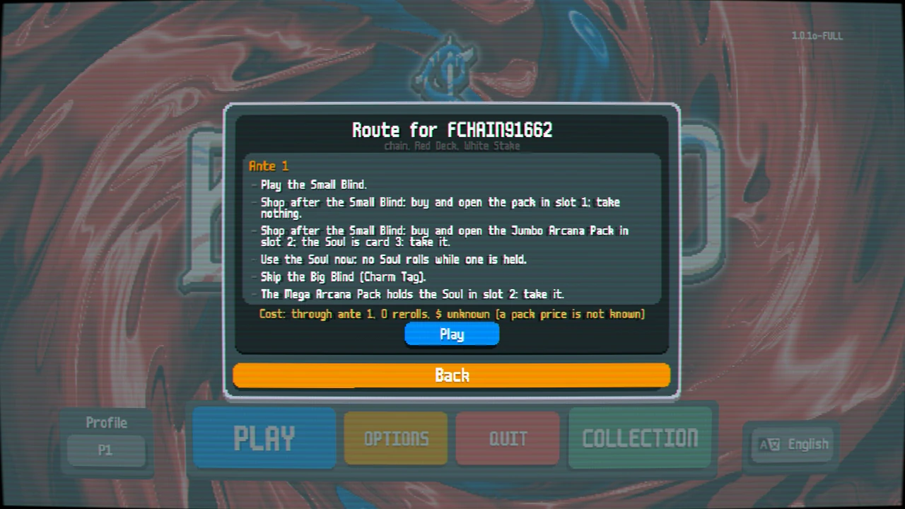
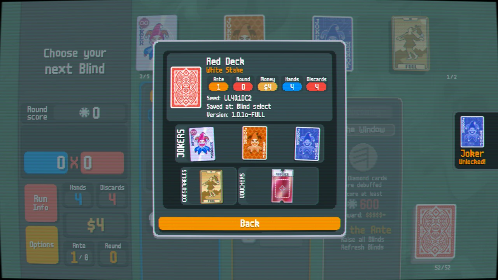
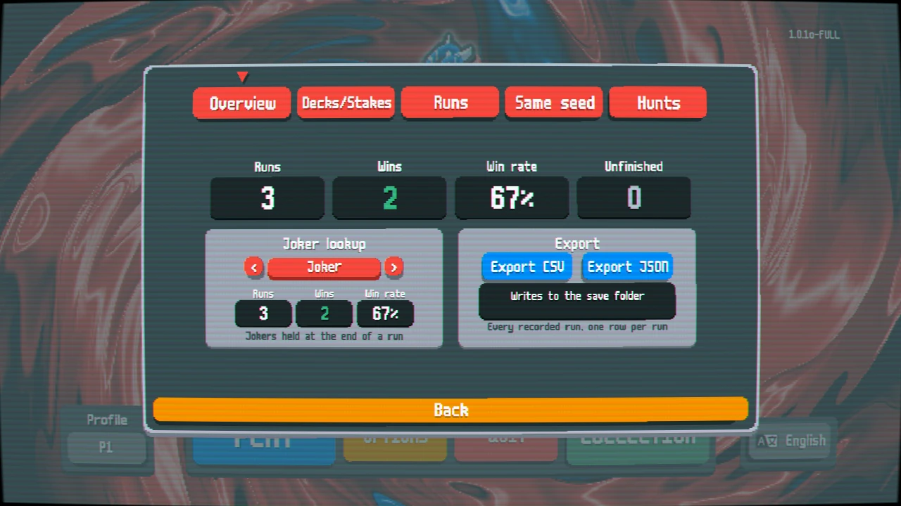

# Balatro Seed Suite

**Find the seed. See what it holds. Play it the way that gets you there.**

Five [lovely](https://github.com/ethangreen-dev/lovely-injector) mods for Balatro: a multithreaded seed finder,
an in-run oracle that predicts shops, packs, tags and bosses, named save slots with previews, and a run journal.
Every prediction is checked against the real game.

**[Download](https://github.com/r-metal/balatro-seed-suite/releases/latest/download/BalatroSeedSuite.zip)** ·
[Install](#install) · [Features](#features) · [How does it know?](#how-does-it-know) · [FAQ](#faq) · [Changelog](CHANGELOG.md)

## Install

1. Install **[lovely](https://github.com/ethangreen-dev/lovely-injector/releases/latest)** (0.9 or newer) by following
   its instructions. Steamodded is not needed. Antivirus software sometimes deletes lovely's DLL: if the game starts
   without mods, allow it and reinstall.
2. Download **[BalatroSeedSuite.zip](https://github.com/r-metal/balatro-seed-suite/releases/latest/download/BalatroSeedSuite.zip)**.
3. Put the zip into your `Mods` folder as it is. There's nothing to unzip.
4. Start the game. If **Play** now shows **Saves** and **Find** tabs, you're done.

**Updating:** replace the zip with the new one. Your saves and journal are kept.

<b>Where is the Mods folder?</b>

| OS | Mods folder |
|---|---|
| Windows | `%AppData%\Balatro\Mods` |
| Linux (Steam + Proton) | `<Steam library>/steamapps/compatdata/2379780/pfx/drive_c/users/steamuser/AppData/Roaming/Balatro/Mods` |
| macOS (untested) | `~/Library/Application Support/Balatro/Mods` |

lovely creates `Mods/` the first time the game starts with it. Under Proton, lovely also needs a launch option: see
[its README](https://github.com/ethangreen-dev/lovely-injector).

<b>Prefer a folder to a zip?</b>

Unzip it so that you get `Mods/BalatroSeedSuite/lovely/`. Watch for an extra level:
`Mods/BalatroSeedSuite/BalatroSeedSuite/` won't load. Keep only one copy in `Mods/`, the zip or the folder.

## Safe to install

- **Lovely only.** No Steamodded, and no other dependencies.
- **Leaves achievements alone.** Nothing in the suite touches achievements or unlocks. The Finder's **Play** starts
  an unseeded run, so it counts for unlocks, stats and high scores.
- **Offline.** It never connects to anything. Save slots and the journal stay in Balatro's save folder.
- **Fails safe.** If part of the suite is missing or from another release, that part switches itself off and the
  main menu says why, so the game still starts.
- **Checked against the real game.** Every prediction is tested against what vanilla generates (see
  [How does it know?](#how-does-it-know)).

## Features

| Mod | What it does | Where |
|---|---|---|
| **[Seed&nbsp;Finder](#seed-finder)** | Searches seeds for multi-clause filters on worker threads, ranks the hits, and gives you the route that delivers each one | **Find** tab of the Play screen, Options |
| **[Seed&nbsp;Oracle](#seed-oracle)** | Predicts the current seed ante by ante: tags, boss, voucher, the Soul's legendary, every shop, reroll and pack | `Ctrl+O` in a run, pause menu |
| **[Save&nbsp;Slots](#save-slots)** | Named save slots with a card-level preview, favorites, per-ante checkpoints, practice scenarios and share codes | **Saves** tab of the Play screen, Options |
| **[Run&nbsp;Journal](#run-journal)** | Records every run, with stats by deck, stake and joker, same-seed comparisons and CSV/JSON export | Next to Stats, Options |
| **bh-core** | The shared library: game events, crash-safe storage and the seed simulator. Included, and every other mod needs it | — |

### Seed Finder

  
  

- **Filters** combine clauses: skip tags, the boss, vouchers, the Soul's legendary, a Soul in a Charm or Ethereal pack,
  shop jokers by ante N (with a reroll budget), packs, and editions.
- **Odds** before you search: how rare a hit is, how long the search should take, and which clause is the bottleneck.
- **Hits are ranked by what they cost to deliver.** **Route** lists the exact plays: which blind to skip, which pack
  to open, which card is the Soul, and when to use it.
- **Play** starts the hit as an unseeded run, so it counts for unlocks, stats and high scores. **Save as hunt** keeps
  it in Save Slots.

### Seed Oracle

- Each ante's skip tags, boss, voucher and Soul legendary, the shop on the shelf and after each reroll, and what every
  pack holds.
- **stable** items are fixed by the seed. **if…** items (shops, rerolls, pack contents) hold as long as nothing else
  draws from the same stream first.
- **What-if toggles:** skip Small, skip Big, rerolls 0–5. The prediction is redone without touching your run.
- **Divergence banner:** when the live shop stops matching, the Oracle says where, what it expected and the likely
  cause (a purchase, a used card…), then predicts again from the run as it is.

### Save Slots

  

- Named slots with a card-level preview of the jokers, consumables and vouchers each one holds. Favorites stay on top.
- An **auto-checkpoint** every ante, so you can rewind, and practice scenarios you compose yourself.
- **Share codes:** copy a slot's seed, deck, stake, notes and filter as one string. Import one to play it.
- Details: [mods/SaveSlots/README.md](mods/SaveSlots/README.md).

### Run Journal

  

- Records every run on its own: antes, blinds, hands and scores, jokers, and the outcome.
- Stats by deck, stake and joker. CSV and JSON export.
- **Same seed:** runs of one seed side by side, ante by ante, and where they diverged.
- **Hunts:** how each Finder filter's runs actually went (runs, wins, best ante).

## How does it know?

The simulator doesn't reimplement Balatro's rules from memory. It calls **the game's own generation code** in a
sandbox that never touches your run, plus a Card-free twin of `create_card` that makes the same random draws in the
same order.

Every change is checked against the real game. A test rig runs the actual Balatro code on LÖVE, and its golden
suites play real seeded runs and compare every prediction with what vanilla generated: 30 antes and 10 Souls,
60 shops, 120 rerolls and 120 opened packs, and a 1,500-draw differential of `create_card`. They all match exactly,
down to the RNG state afterwards. The findings behind this are in the [journal](journal/README.md).

## Compatibility

- **Balatro** 1.0.1o (Steam).
- **Loader:** [lovely](https://github.com/ethangreen-dev/lovely-injector) 0.9 or newer (tested with 0.9.0). Steamodded is not needed.
  Running alongside Steamodded hasn't been tested yet: reports welcome.
- **OS:** the Windows build, tested under Proton on Linux. macOS is untested.

## FAQ

<b>Nothing changed after installing.</b>

Check that lovely is running: after one start with it, `Mods/lovely/log/` exists. Then check that the zip sits
directly in `Mods/`, or that the folder is `Mods/BalatroSeedSuite/lovely/` with no extra level in between.

<b>The main menu says part of the suite is disabled.</b>

Two copies from different releases are installed, or one is incomplete. Keep a single `BalatroSeedSuite.zip` (or
folder) in `Mods/`, from one release.

<b>Do runs started from the Finder count for unlocks?</b>

Yes. **Play** starts an unseeded run on the hit's seed, the way the Brainstorm mod's reroll does, so it counts for
unlocks, stats and high scores.

<b>Is the Oracle ever wrong?</b>

**stable** items don't change unless something in the run rerolls them, and then they are flagged "changed". **if…**
items assume nothing else draws from the same random stream first. Buying or using some cards does that, and the
divergence banner tells you when it happens.

<b>Where is my data, and how do I uninstall?</b>

Save slots and the journal live in Balatro's save folder, under your profile (`<profile>/saveslots/`,
`<profile>/runjournal/`). To uninstall, delete `BalatroSeedSuite.zip` (or the folder) from `Mods/`. Your data stays.

<b>Why is my search slow?</b>

Some filters are very rare. **Odds** tells you roughly how many seeds a hit takes and which clause is the
bottleneck. The Finder searches at tens of thousands of seeds per second, so anything rarer than about 1 in 100 million
takes a long time. Loosen the tightest clause first.

## Contributing

Bug reports and ideas are welcome in [Issues](https://github.com/r-metal/balatro-seed-suite/issues). Building,
testing and the test rig are covered in [CONTRIBUTING.md](CONTRIBUTING.md).

## Credits and license

- **Balatro** is by LocalThunk and published by Playstack. This project is not affiliated with or endorsed by either.
- **[lovely](https://github.com/ethangreen-dev/lovely-injector)** by ethangreen-dev makes Lua mods like these possible.
- This repository contains **no game code or assets**. The test rig runs the game from your own copy.

[MIT](LICENSE) © 2026 The Balatro Seed Suite contributors
